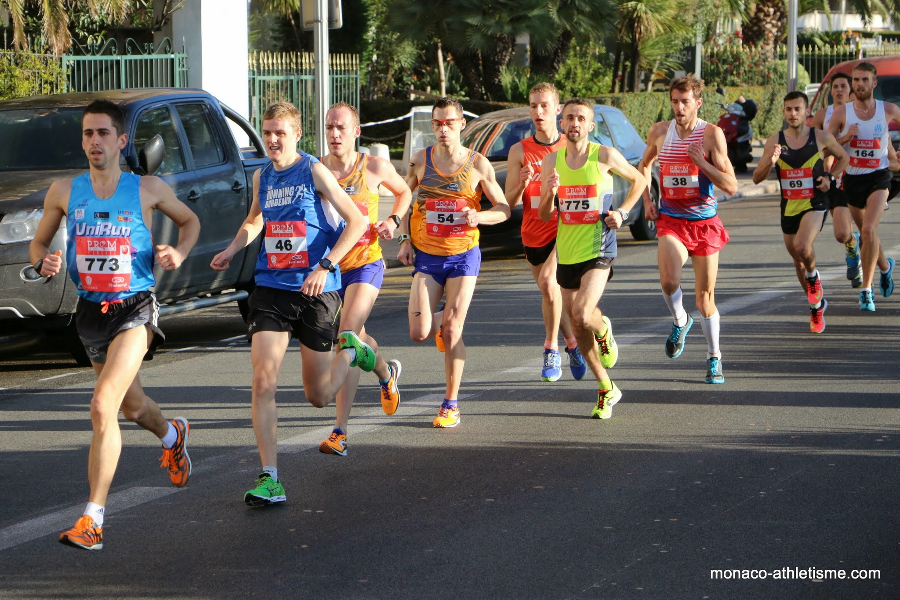
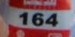
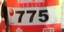
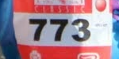
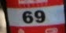
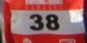
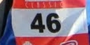
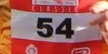

# Bibnumber: automatic bib number recognition from racing photos

Bibnumber automatically recognizes bib number from racing photos. As an example, consider this photo:

Calling bibnumber on this example will produce the following output:

     [ 38 46 54 69 164 773 775]

Bibnumber also creates small images out of the recognized bibs:

## Implementation overview

Bibnumber is tuned for high accuracy rather than high recall. Therefore it is not unusual for a bib to be missing in the output however wrong bib numbers are unusual. Since the algorithm precision is low on single-digit bib numbers, those are ignored.

The general pipeline is as follows:
* Canny edge detection
* Stroke Width Transform (to locate text)
* Text candidates filtering (to detect possible bib numbers)
* Rotation (to correct moderate skew in bib images)
* OCR (to convert text image to bib number)

The precision of the algorithm is low for short bibnumbers (less than 3 digits). Therefore, the processing can split into three stages:
* in the first stage, only bib numbers with 3 digits or more are detected
* in the second stage, the 3+-digit bib images are used to train a HOG+SVM bib detector
* in the third stage, the HOG+SVM detector is used to detect 2-digit bib numbers

## Installation

The following libraries should be installed to build Bibnumber:
* Tesseract
* OpenCV 2.4.x
* Boost
* Leptonica

To build the project:

	make -C bibnumber/Debug

## Command line

	./bibnumber [-train dir] [-model svmModel.xml] image_file|folder_path|csv_ground_truth_file
    
Bibnumber can either process whole directories or individual images files. To automatically quantify the quality of bib detections, a ground truth .csv file can be used and Bibnumber will display the F-score when done.

In order to train a HOG+SVM bib detector from a number of bib images, the training directory may be specified and Bibnumber will create the SVM model.xml file, which can then be used in a second pass to detect shorter bib numbers (2 letters) with better accuracy. 

